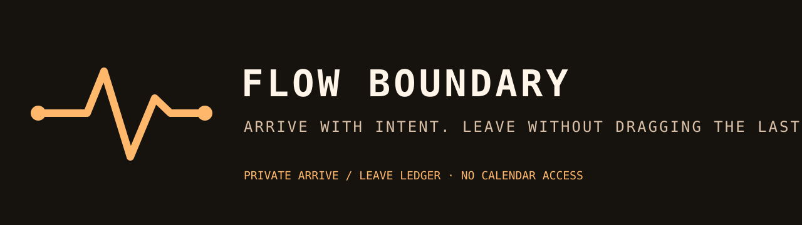

# Flow Boundary



[](https://ko-fi.com/U5S225PTME)

Flow Boundary is a private local ledger for deliberate arrive and leave
boundaries. It makes a small record when you start or end a focus block, helping
you close one context before opening another.

It does not inspect calendar events, project contents, or notification history.
Records live only in your local state directory, are sanitized before display,
and remain bounded.

## Install

```bash
omarchy plugin add https://github.com/jeremylongshore/omarchy-flow-boundary-entry --enable
```

Use the panel's Arrive and Leave actions to create a local boundary record.

## Verify

```bash
npm test
bash scripts/run-plugin-gates.sh
bash scripts/check-lane-freshness.sh
bash scripts/rig-verify.sh .
bash scripts/rig-render.sh . preview.png
```

## License

MIT
